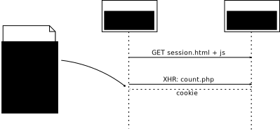

#Cross-domain PHP session via Ajax

__What__: Figure out how to use a session when requesting a script via Ajax that is on another domain as the browser document.

__Why__: Useful for modular development: To test a module in its original place from another project . (No need for another copy!)

Suppose this file resides on foo.com, and makes calls to a script
count.php on another domain, bar.com.
Cookies do not work in this cross-domain setting. 

A solution is to pass the session_id around yourself, as shown here.

The following simple diagrams show the difference between the two situations:

###Same origin

###Another origin

